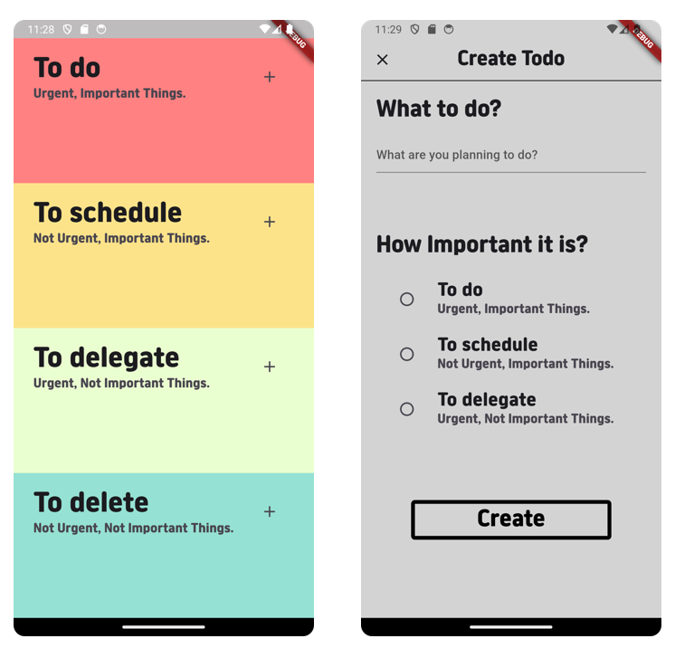

# Simple Todolist App
- The copyright of the app design belongs to others.
---

### How works
##### Overall,


##### In detail,


### Structure
```agsl
- main.dart
- route.dart // Used GoRoute using params
- Model
  - models.dart // Contains model and repository
- View
  - screens.dart
  - widgets.dart
```


